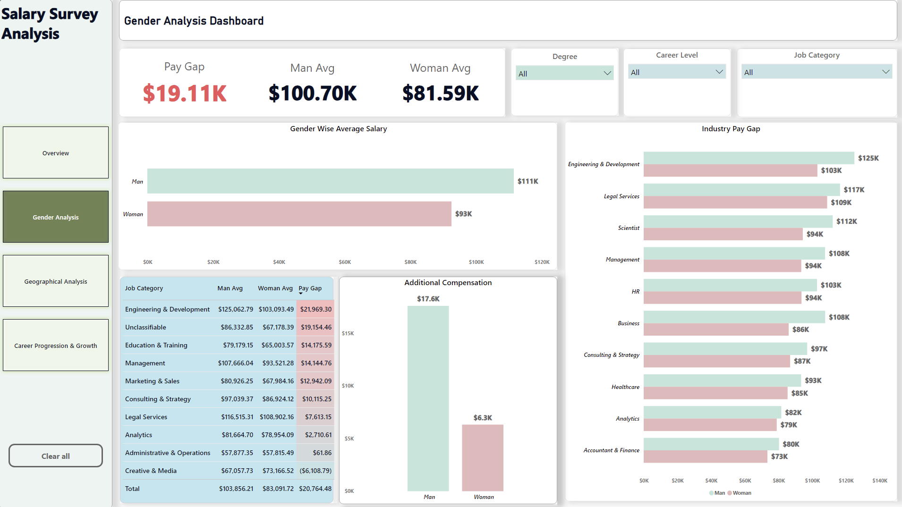
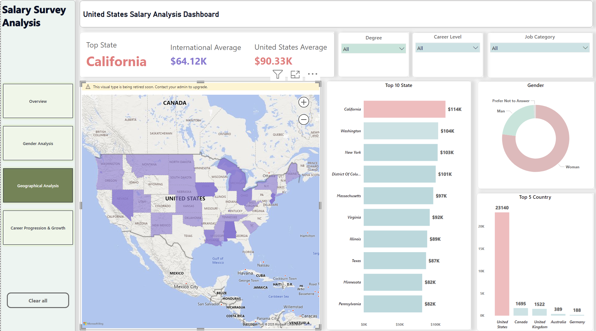
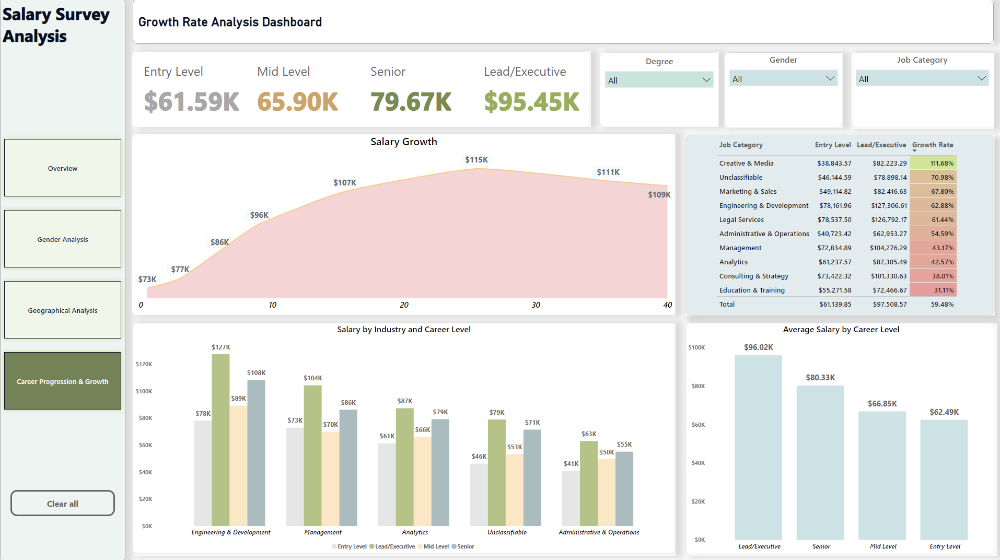

# Salary Survey Analysis - End-to-End Data Analytics Project

Comprehensive analysis of **25,847 global salary survey responses** using Python, PostgreSQL, and Power BI. Transformed raw compensation data into actionable business intelligence, identifying critical gender equity gaps, career progression patterns, and geographic market dynamics.

## Key Findings

- **Average Salary:** $85,928 USD
- **Gender Pay Gap:** $19,110 (23.42% disparity)
- **Top Paying State:** California ($114K average)
- **Best Growth Industry:** Creative & Media (111% entry-to-lead increase)
- **US Market Premium:** 40.7% above international average

## Technologies Used


- **Python:** Pandas, NumPy, Matplotlib, Seaborn (data cleaning & EDA)
- **Excel:** Initial data exploration
- **PostgreSQL:** Database design & 16 advanced SQL queries
- **Power BI:** 4-page interactive dashboard

## Project Structure

```text
Survey_Salary_Analysis_Project/
├── 1.data/              # Raw & cleaned data files
├── 2.notebooks/         # Jupyter notebooks (EDA, cleaning)
├── 3.sql/               # SQL queries and schema scripts
├── 4.powerbi/           # Power BI .pbix dashboards
├── 5.screenshots/       # Dashboard exports for README
└── 6.documentation/     # Final reports and supporting docs
```

## What This Project Demonstrates

1. **Data Cleaning** - Processed 28,235 → 25,847 records (removed duplicates, handled missing values, standardized categories)
2. **Exploratory Analysis** - Created 19+ visualizations, statistical analysis, correlation studies
3. **SQL Analytics** - Designed normalized schema, wrote 16 business intelligence queries
4. **Data Visualization** - Built 4-page interactive Power BI dashboard with drill-down capabilities

## Power BI Dashboard Gallery

<p align="center">
  
  
</p>

<p align="center">
  
  
</p>

**Interactive Features:**
- Filter by country, job category, career level
- Geographic heat maps
- Trend analysis
- Gender pay gap breakdown by industry

## Business Insights Delivered

- Identified $19,110 average gender pay gap across 12 industries
- Mapped 55% salary growth from entry to lead positions
- Discovered 40% US compensation premium vs international markets
- Analyzed correlation between experience, education, and compensation (0.43 correlation coefficient)


📧 Email: smsharifuzzaman113@gmail.com  
💼 LinkedIn: [linkedin.com/in/sm-sharif](https://linkedin.com/in/your-profile)  
🔗 GitHub: [@sm-sharif](https://github.com/sm-sharif)
